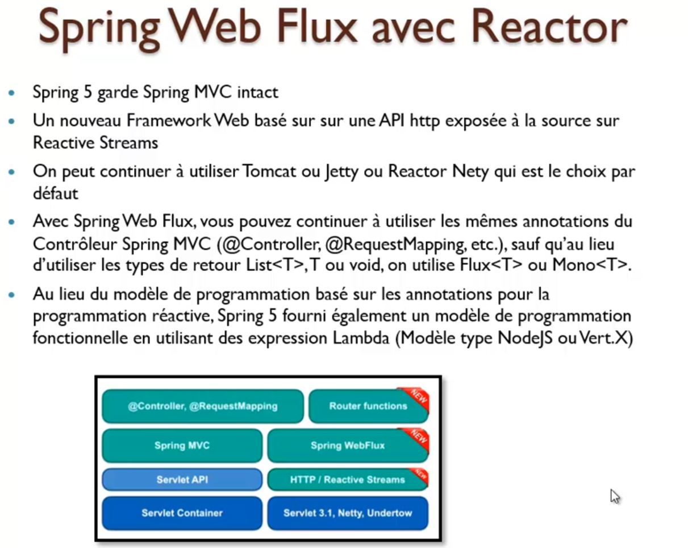

#  Reactor api de Spring avec Web Flux

https://dzone.com/articles/spring-boot-server-sent-events-tutorial  
https://howtodoinjava.com/spring-webflux/spring-webflux-tutorial/  
https://piotrminkowski.com/2018/05/04/reactive-microservices-with-spring-webflux-and-spring-cloud/ 
https://www.youtube.com/watch?v=iuH_B1FutRo  
https://mkyong.com/spring-boot/spring-boot-webflux-server-sent-events-example/  

**Spring WebFlux** est une **fonctionnalité majeure de Spring Framework 5**.
Disposant de son propre **module Maven (spring-weblux)**, ce **nouveau framework web** se positionne comme une **alternative à Spring Web MVC**. Ce dernier a été conçu par-dessus l’API Servlet. Spring WebFlux l’a été pour les **applications réactives**, avec I/O non bloquantes, asynchrones, à **faible latence**, basées sur des serveurs comme **Netty**, **Undertow** ou compatibles **Servlets 3.1 et +**.
Spring WebFlux s’éloigne du modèle d’un thread par requête HTTP et se base désormais sur le projet Reactor pour orchestrer le traitement des requêtes.
Conçu avant tout pour exposer des API REST attaquant des bases NoSQL non bloquantes dans des architecture micro-services, Spring WebFlux peut être utilisé sur des applications web dont les IHM sont rendues côté serveur (ex : avec Thymeleaf ou Freemarker).
## modèle multi Threads booquant

## modèle single Thread non bloquant

## Reactive Stream
Le **backpressure** permet de régler la vitesse de reception des données envoyés par le **publisher** pour eviter que le subscriber soit subermgés par le flow de données reçu. C'est donc bien le subscriber qui décide de la quantité de données à recevoir dans la **requet(n)** qui emet aupres du publisher.   

### Backpressure
Si la  requet demande 3 données **requet(3)**, le **publisher** enverra 3 **onNext(data)**. 

La fin de l'envoi des données par le **publisher** se termine par deux evenements possibles. Soit **Complete** soit **Erreur**.

## Librairies disponible
La librairie **Reactor** est une librairie de **spring**
  

### Reactor spring

### Publisher Flux

### Publisher Mono

### Bloquant non Blquant API

### Flux Json vs Flux SSE (Sever sent event) vs Flux JsonStream
Inconvient de Flux Json est d'attendre de recevoir les données en un seul bloque. Tantis que les autres types ( SSE et JsonStream) les données sont transmise en file de l'eau.

le modele SSE **text/event-stream** est adapté entre un client browser et une application/
Le modele **application/stream+jons** est adapté entre application.   

### nouveautés dans spring 5
Il existe deux modele de programme pour **webflux**.
 - Soit 1 Utilser les memes annotations du **@RestController**
 - Soit 2 Soit la programmation fonctionnelle via exepression Lambda comme nodjs via **callback**

### Web Client

## Application

Dans ce projet nous gerons les actions de banques.
la liasons entre les transactions et société banque est unidirecionnelle.

 

